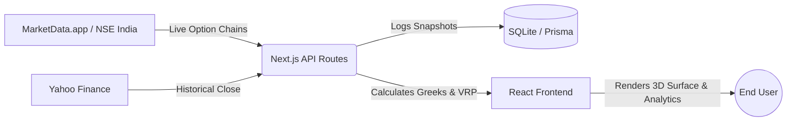

# VRP Global

**An institutional-grade Volatility Risk Premium analysis tool to identify mispriced options across global markets.**


## What is VRP?

**Variance Risk Premium (VRP)** is the spread between the market's expectation of future volatility (Implied Volatility) and the actual historical movement of an asset (Realized Volatility). 

In highly speculative, retail-driven markets, the demand for options can artificially inflate Implied Volatility beyond mathematical reality. By dynamically calculating true historical variance and comparing it to live option prices, this platform allows traders to systematically identify environments where sellers are receiving a structural premium.

## Key Features

*   **Global Options Screener:** Fetches live option chains and instantly calculates Black-Scholes Greeks (Delta, Gamma, Theta, Vega) alongside the exact VRP for every strike.
*   **3D Volatility Surface Visualization:** Interactive 3D topological plots (via Plotly) that map the volatility smile across strike prices and expirations to instantly spot localized mispricings.
*   **Portfolio Risk Aggregator:** Simulates hypothetical options portfolios in real-time, netting Greeks and approximating a 1-day 99% Value at Risk (VaR).
*   **Live Surface Analytics:** Tracks aggregate market states (Average IV, Average VRP, Put-Call Ratio) over time, recording intraday snapshots to a local SQLite database.
*   **Custom Black-Scholes Engine:** A bespoke TypeScript Black-Scholes-Merton engine calculates Greeks natively on the server for markets that don't supply them (like the NSE).
*   **Interactive Methodology Documentation:** Fully transparent breakdown of all quantitative formulas, volatility smile modeling, and Greek derivations.

## Tech Stack

| Layer | Technology |
| :--- | :--- |
| **Frontend** | Next.js 14 (App Router), React, Tailwind CSS, Plotly.js, Recharts |
| **Backend** | Next.js API Routes, NextAuth.js |
| **Database** | SQLite, Prisma ORM |
| **Data Fetching** | `yahoo-finance2`, `stock-nse-india` |
| **Deployment** | Docker, Docker Compose |

## Architecture



## Screenshots

> **Note to self:** Add screenshots here before final portfolio submission!
> 
> *Suggested images:*
> 1. ``
> 2. ``
> 3. ``

## Getting Started

### Prerequisites
*   Docker & Docker Compose (or Node.js 18+ and pnpm)

### Local Setup (Without Docker)

1.  **Clone the repository:**
    ```bash
    git clone https://github.com/creeedd89/vrp-web-app.git
    cd vrp-web-app/web-app
    ```

2.  **Install dependencies:**
    ```bash
    pnpm install
    ```

3.  **Environment Variables:**
    Copy `.env.example` to `.env.local` and configure your variables (see table below).

4.  **Database Migration:**
    ```bash
    npx prisma db push
    ```

5.  **Run Development Server:**
    ```bash
    pnpm dev
    ```

### Local Setup (With Docker)
```bash
docker-compose up --build
```
*Note: The Docker setup relies on named volumes for `node_modules` and runs the dev server on port `3001`.*

## Environment Variables

| Variable | Description | Required |
| :--- | :--- | :--- |
| `NEXT_PUBLIC_APP_URL` | The base URL of the application (e.g., `http://localhost:3000`) | Yes |
| `MARKETDATA_API_TOKEN` | API key for MarketData.app (US Equities). Leave blank for free tier limits. | No |
| `USE_MOCK_DATA` | Set to `true` to bypass live API calls and use simulated option chains. | No |
| `NEXTAUTH_SECRET` | Secret key for JWT encryption. | Yes (in prod) |

## Data Sources

VRP Global currently aggregates data from multiple providers:
*   **US Equities:** MarketData.app (delayed live options data for free accounts).
*   **Indian Equities:** Native routing to the National Stock Exchange of India (NSE) via the `stock-nse-india` package.
*   **Historical Data:** `yahoo-finance2` for calculating True Realized Volatility.

*Note: The `breezeconnect` package is installed in `package.json`, indicating that an integration with ICICI Breeze for live Indian market data execution is planned, but it is not currently implemented in the codebase.*

## Known Limitations / Roadmap

As this is a rapidly evolving portfolio project, the following areas are currently in progress or require attention:

*   **Insecure Authentication:** The current NextAuth implementation uses a mock credentials provider that accepts *any* password and creates users on the fly without secure password hashing or validation. **Do not deploy this authentication flow to a public production environment.**
*   **Broker Integration:** Planning to implement live execution via ICICI Breeze API (SDK installed, but wiring is pending).
*   **Data Latency:** The NSE India fallback requires session cookie negotiation on the first request, which can introduce a ~10-second delay on cold starts.
*   **Limited Historical DB Storage:** Currently logging snapshots to SQLite. For production-scale historical backtesting, this must be migrated to PostgreSQL or TimescaleDB.

## Project Structure

```text
src/
├── app/               # Next.js App Router pages (Screener, Portfolio, Analytics, etc.)
├── features/          # Domain-specific React components and views
├── lib/               # Utility libraries (Prisma client instance)
├── shared/            # Reusable UI components, mock data, and core mathematics logic
└── types/             # Global TypeScript definitions
prisma/                # Database schema and SQLite database
public/                # Static assets and screenshots
docs/                  # Extended documentation (MATHEMATICS.md)
```

## License & Author

*   **License:** MIT
*   **Author:** [creeedd89](https://github.com/creeedd89)
